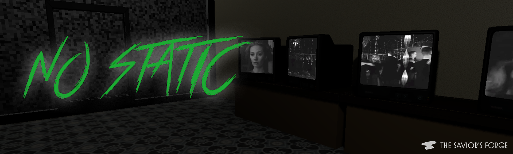
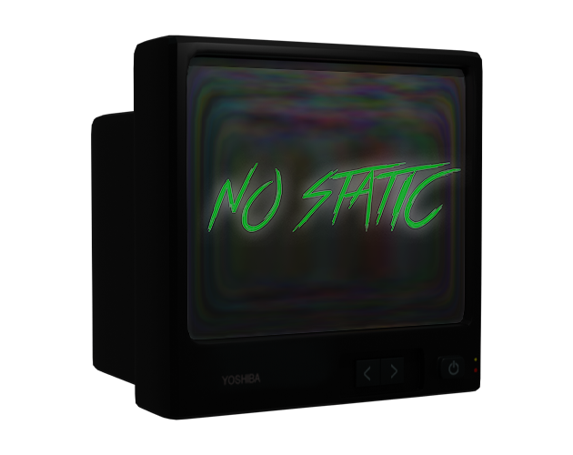
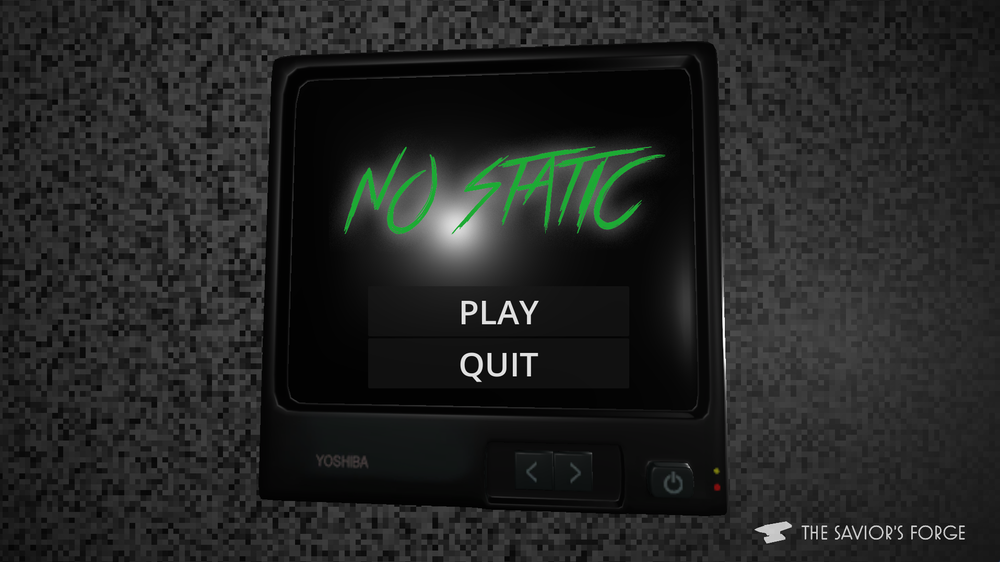
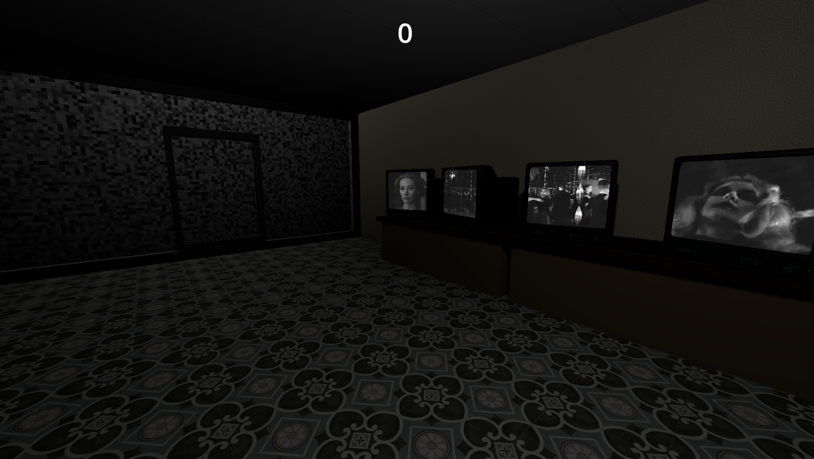

# No Static




NILBOGtheSavior's submission for Solo Development 72-hour Jam #9

## Description



Black-and-white, flickering screens.  
The electronics aren’t just broken tonight…  

Keep the static at bay, or lose yourself in the noise.

[](https://nilbogthesavior.itch.io/no-static)

## Screenshots




# Development Overview

## Core Gameplay

### Concept

It's October in 1967. During your shift at the Static & Co. electronics store, something strange happens. Throughout the evening, the TVs start to malfunction. It is your duty to keep them tuned to prevent the static from taking over!

### Mechanics

- **Movement**: Custom First Person Controller  
- **Interaction**: Raycast selection, area based selection for tuning  
- **Loss Condition**: Health determined by amount of static present

### Goal

Endless score loop, survive as long as you can.

## Architecture

### Engine

Godot 4.5.1

### Scene Structure

```
Game.tscn
├── HUD (Control) [Instance]
├── World Environment
│   ├── Ground (StaticBody3D)
│   │   └── CollisionShape3D
│   └── OmniLight3D
├── Player (CharacterBody3D) [Instance]
├── Timer
├── Static_and_Co (Node3D) [Instance]
├── OmniLight3D
└── OuterNoise (MeshInstance3D)
```

### Singletons

**GameManager**: Keeps track of global state

## Rendering and Shaders

- **Noise Shaders**: Several noise shaders were made to generate noise functions on planes, TV screens, and the player's overlay
- **Highlight Shader**: A highlight shader was created to indicate which meshes the player is currently selecting
- **Post Processing**: Glow was included to illuminate brightly lit TV screens

## Audio System

Each TV had its own positional audio sources. Audio was scaled depending on the static level of the TV.

## Systems and Mechanics

- **TV Malfunction Systems**: TVs are randomly selected from a global group at intervals that shorten as the score increases
- **Player Interaction**: Raycasting is used to select objects from the first person perspective, while area boxes are used for cursor interactions
- **Hints**: Player hints are shown based on global states in the GameManager singleton
- **Difficulty Scaling**: Timer intervals shorten as player score increases

## Art and Assets

Models were created in **Blender** and textured in **Photoshop**.  
Additional procedural textures were generated using custom **shader-based noise functions**.

## Future Improvements

- [ ] Balance scaling (logarithmic instead of linear)
- [ ] Add diverse TVs with different tuning systems
- [ ] Improve lighting (flicker, godrays, post-processing)
- [ ] Add tutorial with a backstory
- [ ] Add configurable settings
- [ ] Decorate the store and make the environment more appealing
- [ ] Improve UI (themed buttons)
- [ ] Add dynamic sound design (radio chatter, environmental ambience)
- [ ] Expand lore through environmental storytelling
